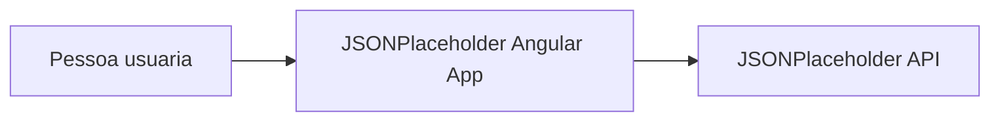

# C4 Level 1 — System Context

Este diagrama mostra quem usa o sistema e com quais sistemas externos ele se integra.

## Responsabilidades

- A pessoa usuaria interage com a interface web.
- A aplicacao Angular processa estado, navegacao e renderizacao.
- A API JSONPlaceholder fornece os dados consumidos pela feature `users`.
