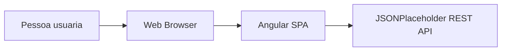

# C4 Level 2 — Container

Este diagrama mostra os containers tecnicos principais da solucao.

## Observacoes

- O frontend roda como SPA no browser.
- O backend externo e consumido via HTTP.
- A organizacao interna da SPA (core/shared/features) e detalhada no nivel de componentes.
