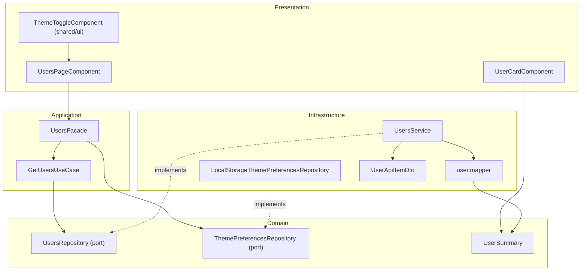

# C4 Level 3 — Components (feature users)

Este diagrama detalha os principais componentes da feature `users` por camada.

## Regras de dependencia aplicadas

- `presentation -> application -> domain`
- `infrastructure -> domain`
- `application` nao importa implementacoes de `infrastructure`
