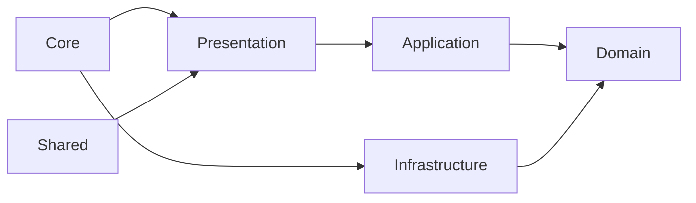

# Feature Clean Architecture

Este documento define a estrutura evolutiva do projeto para suportar todos os resources da API JSONPlaceholder com baixo acoplamento e evolucao incremental.

## Objetivo

Organizar o projeto por feature/resource (`posts`, `comments`, `albums`, `photos`, `todos`, `users`) com camadas internas estaveis:

- `presentation` para UI e interacao com usuario.
- `application` para orquestracao de casos de uso.
- `domain` para regras de negocio e contratos.
- `infrastructure` para detalhes externos (HTTP, mappers, implementacoes).

## Estrutura alvo

```text
src/app/
  core/
    http/
      interceptors/
      http-client.token.ts
    errors/
      app-error.ts
    config/
      env.token.ts

  shared/
    ui/
    utils/
    types/

  features/
    users/
      domain/
        entities/
        value-objects/
        repositories/
        use-cases/
      application/
        facades/
        dto/
      infrastructure/
        api/
          users.api.ts
          users.repository.impl.ts
        mappers/
      presentation/
        pages/
        components/
        store/
        users.routes.ts
      index.ts

    posts/
    comments/
    albums/
    photos/
    todos/
```

## Regras de dependencia

- `presentation -> application -> domain`.
- `infrastructure -> domain` (implementa portas definidas no dominio).
- `domain` nao depende de Angular, HTTP, UI ou detalhes de framework.
- `core` contem infraestrutura transversal reutilizavel.
- `shared` contem apenas utilitarios e componentes sem regra de dominio.
- Cada feature deve expor somente API publica por `index.ts`.



## Contrato padrao por resource

Cada resource novo deve seguir o mesmo kit minimo:

- **Domain**
  - `x.entity.ts`
  - `x.repository.ts` (porta/contrato)
  - `get-x-list.use-case.ts`
- **Infrastructure**
  - `x.api.ts` (datasource HTTP)
  - `x.repository.impl.ts`
  - `x.mapper.ts`
- **Application**
  - `x.facade.ts` (coordena use cases + estado)
  - `x.dto.ts` (quando necessario)
- **Presentation**
  - `x-list.page.ts`
  - componentes de feature
  - `store/` com signals
  - `x.routes.ts`
- **Tests**
  - unit para `use-case`, `mapper`, `facade`
  - integracao leve para repository

## Governanca e qualidade

- Convencoes: `*.entity.ts`, `*.repository.ts`, `*.use-case.ts`, `*.facade.ts`, `*.api.ts`.
- Um arquivo = uma responsabilidade.
- Mapeamento sempre explicito (`api model -> domain entity`).
- Componentes de UI nao chamam `HttpClient` diretamente.
- Regras de import devem ser validadas no lint para proteger fronteiras.
- Decisoes arquiteturais devem gerar ADR curto em `docs/architecture/adr/`.

## Backlog de migracao incremental

### Fase 0 (atual)

- Base em users ja existente em `src/app/domain`, `src/app/data`, `src/app/presentation`.

### Fase 1 (piloto users)

- Migrar users para `src/app/features/users`.
- Criar facade para concentrar estado da feature.
- Introduzir `users.routes.ts` com lazy loading.

### Fase 2 (expansao de valor)

- Implementar `posts` e `todos` com o template padrao.
- Reusar componentes comuns apenas se tiver uso real em 2+ features.

### Fase 3 (complementares)

- Implementar `comments` e `albums`.
- Consolidar politicas de erro e loading no `core`.

### Fase 4 (alto volume)

- Implementar `photos` com paginação, virtualizacao e carregamento incremental.
- Avaliar cache por pagina para reduzir chamadas repetidas.

## Roteamento

- Manter bootstrap e providers globais em `src/app/config/app.config.ts`.
- Evoluir `src/app/config/app.routes.ts` para registrar rotas lazy por feature:
  - `/users`
  - `/posts`
  - `/comments`
  - `/albums`
  - `/photos`
  - `/todos`
