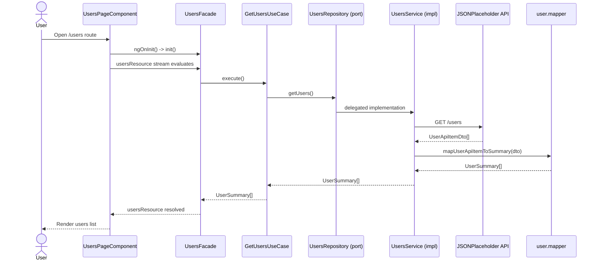

# Sequence 01 — Load users

```mermaid
sequenceDiagram
  actor U as User
  participant P as UsersPageComponent
  participant F as UsersFacade
  participant UC as GetUsersUseCase
  participant R as UsersRepository (port)
  participant S as UsersService (impl)
  participant API as JSONPlaceholder API
  participant M as user.mapper

  U->>P: Open /users route
  P->>F: ngOnInit() -> init()
  P->>F: usersResource stream evaluates
  F->>UC: execute()
  UC->>R: getUsers()
  R->>S: delegated implementation
  S->>API: GET /users
  API-->>S: UserApiItemDto[]
  S->>M: mapUserApiItemToSummary(dto)
  M-->>S: UserSummary[]
  S-->>UC: UserSummary[]
  UC-->>F: UserSummary[]
  F-->>P: usersResource resolved
  P-->>U: Render users list
```
