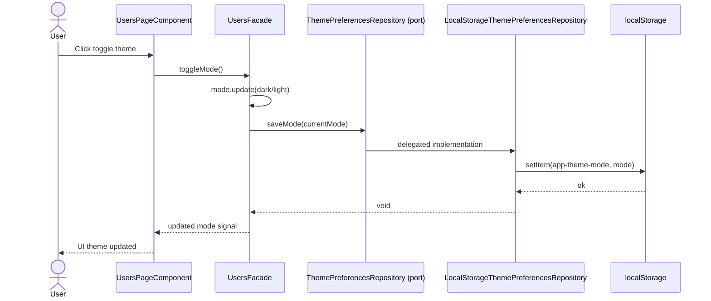

# Sequence 02 — Toggle theme

```mermaid
sequenceDiagram
  actor U as User
  participant P as UsersPageComponent
  participant F as UsersFacade
  participant T as ThemePreferencesRepository (port)
  participant L as LocalStorageThemePreferencesRepository
  participant LS as localStorage

  U->>P: Click toggle theme
  P->>F: toggleMode()
  F->>F: mode.update(dark/light)
  F->>T: saveMode(currentMode)
  T->>L: delegated implementation
  L->>LS: setItem(app-theme-mode, mode)
  LS-->>L: ok
  L-->>F: void
  F-->>P: updated mode signal
  P-->>U: UI theme updated
```
