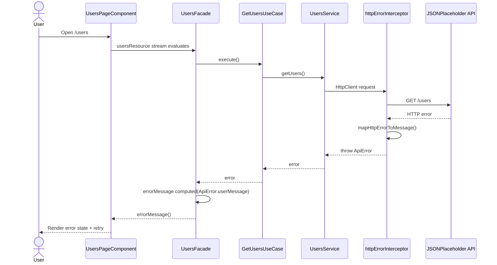

# Sequence 03 — Error flow

```mermaid
sequenceDiagram
  actor U as User
  participant P as UsersPageComponent
  participant F as UsersFacade
  participant UC as GetUsersUseCase
  participant S as UsersService
  participant I as httpErrorInterceptor
  participant API as JSONPlaceholder API

  U->>P: Open /users
  P->>F: usersResource stream evaluates
  F->>UC: execute()
  UC->>S: getUsers()
  S->>I: HttpClient request
  I->>API: GET /users
  API-->>I: HTTP error
  I->>I: mapHttpErrorToMessage()
  I-->>S: throw ApiError
  S-->>UC: error
  UC-->>F: error
  F->>F: errorMessage computed(ApiError.userMessage)
  F-->>P: errorMessage()
  P-->>U: Render error state + retry
```
